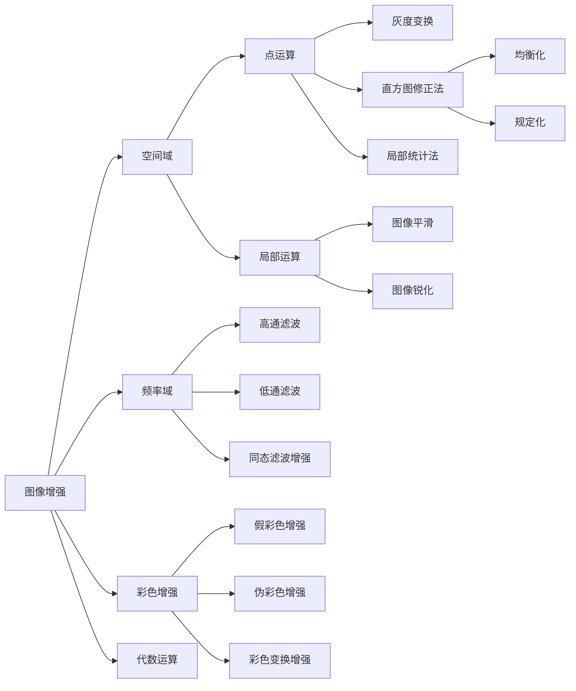

# Computer Vision - (1)Basic

## 颜色空间

### RGB颜色空间

Basic.assets/image-20221024165056370.png)

- 加法混色（适用于彩色显示器）
  - 即越叠加越亮，所有颜色叠加在一起就是白色
- 3个通道
  - Red通道
  - Green通道
  - Blue通道
- 一个像素颜色值（ b, g, r）
  - 注意：不是常说的 RGB
- 取值范围
  - [0, 255]
  - [0.0, 1.0] 

### CMYK颜色空间

Basic.assets/image-20221024165414400.png)

- 减法混色（适合印刷）
  - 即越叠加越黑，所有颜色叠加在一起就是黑色
- 4通道
  - Cyan通道
  - Magenta通道
  - Yellow通道
  - Key通道
- 一个像素颜色值（ c, m, y, k）
- 取值范围
  - [0, 255]
  - [0.0, 1.0]  

### HSV颜色空间

Basic.assets/image-20221024165427954.png)

- 人类视觉概念， 画家配色
- 3个要素
  - H/Hue： 色调， 颜色种类
  - S/Saturation： 饱和度， 颜色的纯度
  - V/Value： 明度， 颜色明亮度
- 一个像素颜色值（ h, s, v）
  - 跟RGB之间是可以相互转换的
- 取值范围
  - [0, 255]
  - [0.0, 1.0]  

### CIE-XYZ颜色空间

Basic.assets/image-20221024165548349.png)

- 国际照明协会， 1931
- 基于人类颜色视觉的直接测定
- 其他颜色空间基础
- 人类视觉系统-视锥细胞
  - 短波（ S, 420-440nm）
  - 中波（ M, 530-540nm）
  - 长波（ L, 560-580nm）
- 3色刺激值通道
  - X， Y， Z约略对应于红色、 绿色、 蓝色
  - 一种波的刺激等于几种波的混合刺激  


## 图片存储原理

主流颜色空间

- RGB三通道彩色图
- 单通道灰度图 

### RGB三通道彩色图

图片 => 3维矩阵（ [0,255]）  

除了图片自身的宽(W)与高(H)以外，还有一个通道(Channels)的属性，指的是不同颜色通道在这张图中的分布情况是什么样的。

Basic.assets/image-20221024165835277.png)

Basic.assets/image-20221024165845894.png)

### 单通道灰度图

相当于一层的三通道彩色图，即通道属性为1。

亮度信息：（[0, 255]）

有公式可以把彩色图转成灰度图：

- $$Gray=R * 0.299+G *0.587+B*0.114$$ 

  Basic.assets/image-20221024170436318.png)

### 常见储存格式

常见的存储的格式有： bmp, jpg, png, tiff, gif, pcx, tga, exif, fpx, svg, psd, cdr, pcd, dxf, ufo, eps, ai, raw, WMF, webp等

- BMP： 采用位映射存储格式， 不采用其他任何压缩， 所占用的空间很大。
- JPG： 最常见的有损压缩格式， 能够将图像压缩到很小的空间， 压缩比可达10:1到40:1之间。
- GIF： 基于LZW算法的连续色调的无损压缩格式， 其压缩率一般在50%左右。
- PNG： 是比较新的图像文件格式， 能够提供长度比GIF小30%的无损压缩图像文件  


## 图像增强的目标 

在获取图像的过程中，由于多种因素的影响，导致图像质量多少会有所退化。

图像增强的目的：

- 改善图像的视觉效果； 

- 转换为更适合于人或机器分析处理的形式；
- 突出对人或机器分析有意义的信息；
- 抑制无用信息， 提高图像的使用价值；

具体的说：**包括图像锐化， 平滑、 去噪， 灰度调整（ 对比度增强）**  

它不是以图像保真度为原则，而是通过处理设法有选择地突出便于人或机器分析某些感兴趣的信息，抑制一些无用的信息，以提高图像的使用价值。

图像增强目前还缺乏统一的理论，这与没有衡量图像增强质量通用的、客观的标准有关。增强的方法往往具有针对性，增强的结果只是靠人的主观感觉加以评价。因此，图像增强方法只能有选择地使用。

## 图像增强的方法

图像增强方法从增强的作用域出发，可分为空间域增强和频率域增强两种。

- 空间域增强是直接对图像像素灰度进行操作；
- 频率域增强是对图像经傅立叶变换后的频谱成分进行操作，然后经傅立叶逆变换获得所需结果。



## 空间域处理及其变换

空间域就是简单的包含图像像素的平面，本部分的所有内容都是基于该平面进行的一些操作。

### 点运算

由于图像是由众多像素点组成，每个像素点都有对应的灰度。点运算本质上是对图像像素灰度的运算。因此基于此，则有了许多种不同的运算方法：例如让像素点的值都变大（直方图滑动），将原本未覆盖所有值的像素点直接拉伸使其范围至[0,255]（直方图拉伸），将所有的像素点灰度值代入到特定模型中变换（灰度变换）等。

这里将这些方法按照是否依据`直方图`来进行划分。

- 灰度变换
- 直方图相关

#### 灰度变换

灰度变换可使图像动态范围增大，图像对比度扩展，图像变清晰，特征明显，是图像增强的重要手段之一。主要思想是，令原图像f（i，j）的灰度范围[a，b]，经过一些变换后图像g（i，j）得到新的范围[a'，b']。根据变换的情况不同又可以分为：

- 线性变换
  - 图像翻转
- 分段线性变换
- 非线性变换
  - 对数变换
  - 指数变换

#### 直方图修正 

灰度直方图反映了数字图像中每一灰度级与其出现像素频率间的统计关系。它能描述该图像的概貌，例如图像的灰度范围、每个灰度级出现的频率、灰度级的分布、整幅图像的平均明暗和对比度等，为对图像进一步处理提供了重要依据。采用直方图修整后可使图像的灰度间距拉开或使灰度分布均匀，从而增大反差，使图像细节清晰，达到增强的目的。

- [直方图滑动](http://www.vue5.com/dip/histogram_sliding.html)：只是简单地向右或向左移动完整的直方图，从而提高或降低图像的亮度。
- [直方图拉伸](http://www.vue5.com/dip/histogram_stretching.html)：基于公式$\mathrm{g}(\mathrm{x}, \mathrm{y})=\frac{\mathrm{f}(\mathrm{x}, \mathrm{y})-\mathrm{fmin}}{\mathrm{fmax}-\mathrm{fmin}} * 2^{\mathrm{bpp}}$将原图像$f$转化为$g$。(bpp是位数)
- 直方图均衡化: 通过对原图像进行某种变换，使原图像的灰度直方图修正为均匀分布的直方图。
- 直方图规定化(直方图匹配): 通过一个灰度映像函数，将原灰度直方图改造成所希望的直方图, 用于产生处理后有特殊直方图。

##### 直方图（Histogram）

对图片数据/特征分布的一种统计

- 灰度、 颜色
- 梯度/边缘、 形状、 纹理
- 局部特征点、 视觉词汇

区间（ bin）

- 具有一定的统计或物理意义
- 一种数据或特征的代表
- 需要预定义或基于数据进行学习
- 数值是一种统计量： 概率、 频数、 特定积累  

Basic.assets/image-20221024171454712.png)

##### 直方图均衡化 (Histogram equalization)

如果一幅图像的像素灰度值在一个过于有限的范围内聚集，那么图像的程序效果即会很糟糕，直接观感就是对比度很弱。下图来自维基百科，第一幅图的直方图分布非常不均衡。如果把直方图均匀地延展到整个分布域内，则图像的效果显得好了很多。

Basic.assets/1620.png)

直方图均衡化是指： **利用图像直方图对==对比度==进行调整的方法。**

- 直方图均衡化通常用来增加许多图像的局部对比度， 尤其是当图像的有用数据的对比度相当接近的时候。
- 直方图均衡化以后， 亮度可以更好地在直方图上分布。 这样就可以用于增强局部的对比度而不影响整体的对比度， 直方图均衡化通过有效地扩展常用的亮度来实现这种功能。
- 实质上是对图像进行非线性拉伸
- 重新分配各个灰度单位中的像素点数量， 使一定灰度范围像素点数量的值大致相等。  

设 *f* 为原始灰度图像，*g* 为直方图均衡化的灰度图像，则 *g* 和 *f* 的每个像素的映射关系如下：
$$
G_{i, j}=\text { floor }\left((L-1) \sum_{n=0}^{f_{i, j}} p_{n}\right)
$$

- 其中，L 为灰度级，通常为 256，表明了图像像素的强度的范围为 0 ~ L-1;
- $$p_n$$ 等于图像 $f$ 中强度为 n 的像素数占总像素数的比例，即原始灰度图直方图的概率密度函数；
- $f_{i,j}$表示在图像 $f$ 中，第 i 行，第 j 列的像素强度；$G_{i,j}$ 表示在图像 $G$ 中，第 i 行，第 j 列的像素强度。

##### 自适应直方图均衡 (Adaptive histgram equalization)

直方图均衡的经典算法对整幅图像的像素使用相同的变换， 如果图像中包括明显亮的或者暗的区域， 则经典算法作用有限。

- 自适应直方图均衡（ AHE） 算法通过对局部区域进行直方图均衡， 来解决上述问题。
- 移动模板在原始图片上按特定步长滑动；
- 每次移动后， 模板区域内做直方图均衡， 映射后的结果赋值给模板区域内所有点，
- 每个点会有多次赋值， 最终的取值为这些赋值的均值。  

##### 限制对比度自适应直方图均衡(Contrast Limited Adaptive histgram equalization)

AHE会过度放大图像中相对均匀区域的噪音， 可采用限制对比度自适应直方图均衡(CLAHE) 。

与普通的自适应直方图均衡相比， CLAHE的不同地方在于直方图修剪过程， 用修剪后的直方图均衡图像时， 图像对比度会更自然。  

Basic.assets/image-20221024173819517.png)

Basic.assets/image-20221024173911529.png)

- 小黑点的灰度直接由映射函数计算得到；
- 粉色区域内点的灰度由映射函数计算而得；
- 绿色区域内点的灰度由由相邻2块灰度映射值线性插值而得；
- 其他区域所有点的灰度由相邻4块的灰度映射值双线性插值而得。  

**算法步骤:**

1. 图像分块， 以块为单位；

2. 先计算直方图， 然后修剪直方图， 最后均衡；

3. 遍历操作各个图像块， 进行块间双线性插值；

4. 与原图做图层滤色混合操作。 （ 可选）

   Basic.assets/image-20221024174011648.png)

### 形态学运算

形态学转换主要针对的是二值图像（0或1），因此需要将图像进行二值化后再使用卷积核对图像进行腐蚀。卷积核是腐蚀中的关键数组，采用numpy库可以生成。卷积核的中心点逐个像素扫描原始图像。

被扫描到的原始图像中的像素点，只有当卷积核对应的元素值均为1时，其值才为1，否则其值修改为0。换句话说，遍历到的黄色点位置，其周围全部是白色，保留白色，否则变为黑色，图像腐蚀变小。


因此，可腐蚀操作会导致图像变小，变小的范围取决于使用的卷积核（即下图的B）的大小。而与之对应，膨胀操作则是与腐蚀操作完全相反，会使图像变大。

- 膨胀是图像中的高亮部分进行膨胀， 类似于领域扩张。  

- 腐蚀是原图的高亮部分被腐蚀， 类似于领域被蚕食。

  Basic.assets/image-20221024174319759.png)  

通常来说，需要光使用两者中的一个，都是无法很好的达到要求的。因此，基于腐蚀与膨胀操作，可以进行一些运算：

- 开运算： 先腐蚀再膨胀， 可以去掉目标外的孤立点。
- 闭运算： 先膨胀再腐蚀， 可以去掉目标内的孔。
- 通常， 当有噪声的图像用阈值二值化后， 所得到的边界是很不平滑的， 物体区域具有一些错判的孔洞， 背景区域散布着一些小的噪声物体， 连续的开和闭运算可以显著的改善这种情况。 

### 图像平滑

在尽量保留图像细节特征的条件下对噪声进行抑制，通过抑制高频段来减少噪音，同时会造成图像一定程度上的**模糊**，这也叫做平滑或者低通滤波器；进行平滑时，邻域内不同位置的像素被赋予不同的权值，对图像进行平滑的同时，同时能够更多的保留图像的总体灰度分布特征。

#### 空间滤波基础

##### 邻域运算


邻域运算是一个概念的泛称，是通过对目标像素的邻域进行加权得到新的目标像素的值，其中这个加权矩阵叫做邻域算子（局部算子）。**其实就是卷积的过程**。
$$
h[x, y]=\sum_{k, l} f[k, l] I[x+k, y+l]
$$

- $h(x, y)$就是滤波后希望得到的函数(滤波结果)，$f(x, y)$就是邻域算子(滤波函数)，$I(x, y)$就是原图(像素邻域值)

##### 空间滤波器

空间滤波器由（1）一个邻域（典型地是一个较小的矩形），（2）对该邻域包围的图像像素执行的预定义操作组成。滤波产生一个新像素，新像素的坐标等于邻域中心的坐标，像素的值是滤波操作的结果。滤波器的中心访问输入图像中的每个像素，就生成了处理（滤波）后的图像。如果在图像像素上执行的是线性操作，则该滤波器称为线性空间滤波器。否则，滤波器就称为非线性空间滤波器。

**在图像中的任意一点（x，y），滤波器的响应（x，y）是滤波器系数与由该滤波器包围的图像像素的乘积之和：**


> 在图像处理文献中，很可能会遇到卷积滤波器、卷积模板或卷积核这些术语。按惯例，这些术语用来表示一种空间滤波器，并且滤波器未必用于真正的卷积。类似地，模板与图像的卷积通常用于表示我们刚刚讨论的滑动乘积求和处理，而不必区分相关与卷积间的差别。更合适的是，它通常用于表示两种操作之一。这一不太严密的术语是产生混淆的根源。
>
> ——数字图像处理（第三版）（冈萨雷斯，伍兹，阮秋琦，阮宇智）

可以发现，当图片经过卷积后，最终图片大小是会受到影响的，因此为了不改变图片大小，可对初始图片进行边界填充。

##### 边界填充（ Padding）

- 获得同尺寸输出的情况下
- 卷积核越大， 补充越多  

补充类型

- 补零（ zero-padding）
- 边界复制（ replication）
- 镜像（ reflection）
- 块复制（ wraparound）  


##### 卷积(Convolution)与互相关(Cross-correlation)

- 相关是滤波器模板移过图像并计算每个位置乘积之和的处理。
- 卷积的机理相似，但滤波器首先要旋转180°。

具体区别参见：[卷积（convolution）与互相关(cross-correlation)的一点探讨 - 知乎 (zhihu.com)](https://zhuanlan.zhihu.com/p/33194385)

#### 均值滤波示意

均值滤波器可以归为低通滤波器，是一种线性滤波器，其输出为邻域模板内的像素的简单平均值，主要用于图像的模糊和降噪。对目标像素及周边像素取平均值后再填会目标像素来实现滤波目的，即邻域算子都是1/M*N的一种特殊形式的邻域滤波。

- 奇数尺寸：2n-1 * 2n-1
- 参数和为1


当滤波器的模板的所有的系数都相等时称之为盒状滤波器(Box Filter)：
$$
\alpha\left[\begin{array}{lll}
1 & 1 & 1 \\
1 & 1 & 1 \\
1 & 1 & 1
\end{array}\right]
$$
当$α=1$时，盒状滤波器可以很方便的计算图像像素邻域的和，对计算图像的各种积分特性例如图像的协方差矩阵，是很有帮助的。

缺点：均值滤波本身存在缺陷，既没有很好地去除噪声点，也破坏了图像的细节反而使图像变得模糊。  

#### 中值滤波

在一连串数字｛1，4，6，8，9｝中，数字6就是这串数字的中值。3*3的矩阵，里面有9个像素点，将9个像素进行排序，最后将这个矩阵的中心点赋值为这九个像素的中值。

- 有效去除椒盐噪声.

  

#### 高斯滤波

高斯滤波器是利用高斯核的一个2维的卷积算子（线性滤波器），对于抑制服从正态分布的噪声非常有效。

对于高斯核主要有两个参数：**高斯核的大小、离散程度σ。** 

可以知道：为了尽可能的平滑，高斯核应该越大越好，但是对于3σ之外的值，其影响已经不是很大了，所以一般对于其边缘的值小于3σ，一般其大小是2*k+1，为奇数，此时中心点就是（k+1，k+1），然后代入上面公式，分别求得每个位置的值，可以看到因为不是无限大，所以其和应该是略小于1，所以有的时候，在计算的时候不是除以$ 2 * pi * σ$，而是分别求出来，再相加作为分母，这样其和就是1了，具体情况具体分析，效果差不多！ 注：k+1是默认下标从1开始的。


高斯滤波手动实现代码：

```python
# -*- coding: utf-8 -*-
import imageio
import numpy as np

def GaussianFilter(img):
    h,w,c = img.shape
    # 高斯滤波 
    K_size = 3
    sigma = 1

    # 零填充
    pad = K_size//2
    out = np.zeros((h + 2*pad,w + 2*pad,c),dtype=np.float)
    out[pad:pad+h,pad:pad+w] = img.copy().astype(np.float)

    # 定义滤波核
    K = np.zeros((K_size,K_size),dtype=np.float)

    for x in range(-pad,-pad+K_size):
        for y in range(-pad,-pad+K_size):
            K[y+pad,x+pad] = np.exp(-(x**2+y**2)/(2*(sigma**2)))
    K /= (sigma*np.sqrt(2*np.pi))
    K /=  K.sum()

    # 卷积的过程
    tmp = out.copy()
    for y in range(h):
        for x in range(w):
            for ci in range(c):
                out[pad+y,pad+x,ci] = np.sum(K*tmp[y:y+K_size,x:x+K_size,ci])

    out = out[pad:pad+h,pad:pad+w].astype(np.uint8)

    return out

if __name__ == "__main__":
    # 读取图像
    img = imageio.imread("lena.jpg")
    # 高斯滤波
    imageio.imsave("GaussianFilter.jpg",GaussianFilter(img))
```

### 图像锐化

锐化处理的主要目的是突出灰度的过渡部分。图像锐化的用途多种多样，应用范围从电子印刷和医学成像到工业检测和军事系统的制导等。图像模糊可通过在空间域用像素邻域平均法实现。因为均值处理与积分类似，在逻辑上，可以得出锐化处理可由空间微分来实现这一结论。

事实上，的确如此，且本节将讨论由数字微分来定义和实现锐化算子的各种方法。基本上，微分算子的响应强度与图像在用算子操作的这一点的突变程度成正比，这样，图像微分增强边缘和其他突变（如噪声），而削弱灰度变化缓慢的区域。

#### 拉普拉斯算子

我们最关注的是一种各向同性滤波器，这种滤波器的响应与滤波器作用的图像的突变方向无关。也就是说，各向同性滤波器是旋转不变的，即将原图像旋转后进行滤波处理给出的结果与先对图像滤波然后再旋转的结果相同。

可以证明（Rosenfeld and Kak[1982]），最简单的各向同性微分算子是拉普拉斯算子。一个二维图像函数f（x，y）的拉普拉斯算子定义为:
$$
\nabla^{2} f=\frac{\partial^{2} f}{\partial x^{2}}+\frac{\partial^{2} f}{\partial y^{2}}
$$
因为任意阶微分都是线性操作，所以拉普拉斯变换也是一个线性算子。拉普拉斯是一种微分算子，因此其应用强调的是图像中灰度的突变，并不强调灰度级缓慢变化的区域。这将产生把浅灰色边线和突变点叠加到暗色背景中的图像。将原图像和拉普拉斯图像叠加在一起的简单方法，可以复原背景特性并保持拉普拉斯锐化处理的效果。

注意：**如果所使用的定义具有负的中心系数，那么必须将原图像减去经拉普拉斯变换后的图像而不是加上它，从而得到锐化结果。**所以，我们使用拉普拉斯对图像增强的基本方法可表示为下式：
$$
g(x, y)=f(x, y)+c\left[\nabla^{2} f(x, y)\right]
$$
其中，f（x，y）和g（x，y）分别是输入图像和锐化后的图像。

> 如果使用图3.37（a）或图3.37（b）中的拉普拉斯滤波器，则常数c=-1，如果使用另外两个滤波器，则常数c=1。
>
> 
>
> ——数字图像处理（第三版）（冈萨雷斯，伍兹，阮秋琦，阮宇智）

#### Sobel算子

Sobel算子的思想，Sobel算子认为，邻域的像素对当前像素产生的影响不是等价的，所以距离不同的像素具有不同的权值，对算子结果产生的影响也不同。一般来说，距离越远，产生的影响越小。

Sobel算子的原理，对传进来的图像像素做卷积，卷积的实质是在求梯度值，或者说给了一个加权平均，其中权值就是所谓的卷积核；然后对生成的新像素灰度值做阈值运算，以此来确定边缘信息。 

若Gx是对原图x方向上的卷积，Gy是对原图y方向上的卷积；
$$
\mathbf{G}_{\mathbf{x}}=\left[\begin{array}{lll}
-1 & 0 & +1 \\
-2 & 0 & +2 \\
-1 & 0 & +1
\end{array}\right] * \mathbf{A} \quad \text { and } \quad \mathbf{G}_{\mathbf{y}}=\left[\begin{array}{ccc}
+1 & +2 & +1 \\
0 & 0 & 0 \\
-1 & -2 & -1
\end{array}\right] * \mathbf{A}

\\ 原图中的作用点像素值通过卷积之后为:

G=\sqrt{G_{x}^{2}+G_{y}{ }^{2}}

\\ 可以简化成:

|G|=|G x|+|G y|
$$


## 参考文章

- [[Python图像处理\] 四.图像平滑之均值滤波、方框滤波、高斯滤波、中值滤波及双边滤波 - 腾讯云开发者社区-腾讯云 (tencent.com)](https://cloud.tencent.com/developer/article/1910147)
- [图像处理之图像腐蚀_万吼吼的博客-CSDN博客_图像腐蚀](https://blog.csdn.net/weixin_43873671/article/details/113896525)
- [直方图拉伸 (vue5.com)](http://www.vue5.com/dip/histogram_stretching.html)
- [深度学习中的各种卷积_滤波器 (sohu.com)](https://www.sohu.com/a/298275731_468638)