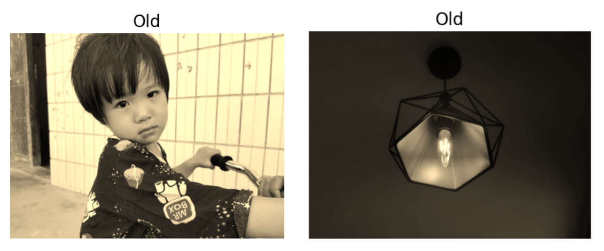

# CS7GV1-2022-Midterm

## Part 1

In this part, I plan to apply 7 different enhancement or effects filters in my images. They are, respectively:

- Binary filter
- Relief filter
- Sketch filter
- Old-style filter
- Time flies filter
- Light filter
- Mosaic filter

### Comparison of Pictures

This part mainly uses three images, and the following is the effect after applying these filters:

> 
>
> <p align='center'>Figure 1.1: Flower</p>

> 
>
> <p align='center'>Figure 1.2: Light of room</p>


> 
>
> <p align='center'>Figure 1.3: My lovely niece</p>

### Introduction of Filters

#### Binary filter

This is a very simple filter, which is used to transform an image into a binary image by changing the pixel values according to the pre-set threshold. The specific conversion process is to first use the formula: $gray=0.299*red+0.587*green+0.114*blue$ to convert the colour image into a grayscale image, and then set different thresholds according to the situation of the image, by traversing each pixel of the image Point, compare it with the threshold, the part greater than the threshold will be reset to 255, otherwise it will be set to 0.

In the picture used, after applying the binary filter to this child image, it is very direct to distinguish the person from the surrounding environment, and the main form of the person is also present, which is very interesting.

> 
>
> <p align='center'>Figure 1.4: Image of Child with Binary filter applied</p>

#### Relief filter

This is a relief effect. By traversing the picture, the parts of the picture with large changes in pixel value are highlighted, showing the effect of carving on the stone. The specific algorithm flow is: to traverse each pixel of the image through a double-layer loop, use the difference between adjacent pixel values to represent the current pixel value to obtain the edge features of the image, and finally add a fixed value of 120 to get the relief effect.

In the pictures used, the effect of the child and flower is more surprising. The main part of the figure is embossed, and the rest is in a sunken state, which is very perfect. As for the flower map, the petals are recessed, which also presents a very unexpected effect.

> 
>
> <p align='center'>Figure 1.5: Images of Child and Flower with Relief filter applied</p>

#### Sketch filter

The sketch filter is the most interesting. The key to the processing of the sketch filter is the search for the edge, and the line sense of the object can be obtained by searching the edge. After the grayscale processing of the image, a threshold value needs to be determined first, which needs to be continuously adjusted according to the effect of the image. Because the sketch mainly emphasizes the change of light and shade, and the drawing is in the oblique direction. Through experience, I compare the grey value of each pixel with the grey value of the lower right corner. When it is greater than this threshold, it is judged. is contoured and drawn.

In the pictures used, the effect of the light and flowers is better, and the effect of the child is scary. As you can see, the effects of the flowers and lights are very real, like a real sketch.

> 
>
> <p align='center'>Figure 1.6: Images of Flower and Light with Sketch filter applied</p>

#### Old-style filter

The old-style filter refers to the dim effect of the image through the years. The main implementation method is the result of processing the three RGB components of the image according to a certain proportion. The nostalgic formula is as follows:
$$
\begin{array}{l}
\mathrm{R}=0.393 * \mathrm{r}+0.769 * \mathrm{~g}+0.189 * \mathrm{~b} \\
\mathrm{G}=0.349 * \mathrm{r}+0.686 * \mathrm{~g}+0.168 * \mathrm{~b} \\
\mathrm{B}=0.272 * \mathrm{r}+0.534 * \mathrm{~g}+0.131 * \mathrm{~b}
\end{array}
$$
Although the implementation method is very simple, the final effect is amazing, I think that under this filter, the effect of the light and the effect of children are very good.

> 
>
> <p align='center'>Figure 1.7: Images of Child and Light with Old-style filter applied</p>

#### Time flies filter

The time files filter is used to describe the time or years that pass like flies. In image processing, it specifically refers to converting the original image into special effects with a sense of the times or the precipitation of the years. The main process of implementing this filter is to take the root of the pixel value of the blue (B) channel of the original image and multiply it by a weight parameter (12 is set here) to produce the final fleeting effect.

> 
>
> <p align='center'>Figure 1.8: Images of Flower and Child with Time flies filter applied</p>

#### Light filter

A light filter means that the image has a halo effect similar to a light, and the pixel value of the image is enhanced in a circular range around the centre of the light. The implementation code mainly traverses each pixel of the image through a double-layer loop, finds the centre point of the image, and then calculates the distance from the current point to the centre of illumination (the distance between two points in the plane coordinate system) to determine the distance and the centre of the image. The size relationship of the circle radius, the grey value of the image within the range of the central circle is enhanced, and the grey value of the image outside the range is retained, and the final lighting effect is generated by combining the boundary range judgment.

In the picture used, applying this filter to other pictures may have some unexpected effects, but in this picture of the lamp, there are just unexpected surprises. 

> 
>
> <p align='center'>Figure 1.9: Images of Light with Light filter applied</p>

#### Mosaic filter

Mosaic effect is a widely used image or video processing method. It degrades the details of the colour level in a specific area of the image or video and causes the effect of disrupting the colour blocks. The main purpose is usually to make the specific area unrecognizable. The implementation principle is very simple, that is, the pixels in a certain set can be the same. The range set here is 5 pixels.

Using it on a character can also protect the character's privacy.

> 
>
> <p align='center'>Figure 1.10: Images of Child with Mosaic filter applied</p>


## Part 2

In this part, I  applied 5 different softening and sharpening filters to my images. They are, respectively:

- Sharpen filter
- Emboss filter
- Unsharp Masking filter
- Mean filter
- Gaussian filter
- Bilateral filter
- Median filter

### Comparison of Pictures

This part mainly uses three images, and the following is the effect after applying these filters:

> 
>
> <p align='center'>Figure 2.1: Dogs of applying different filters</p>

> 
>
> <p align='center'>Figure 2.2: Night sky of applying different filters</p>


> 
>
> <p align='center'>Figure 2.3: Sunset of applying different filters</p>

### Introduction of Filters

The filter operations in this part all use convolution operations to modify the image's pixel values. Therefore, the main process of all filters is similar, only the difference in the convolution kernel will lead to different results. 

The main process is: to fill the original image with 0, then traverse each channel of the image to get the pixel value of the corresponding channel, and then use the matrix multiplication of the convolution kernel and the pixel value to get the new pixel value at this position, to generate a new image.

#### Sharpen filter

The effect of accentuating edges can be achieved by enlarging the pixel value of the original image by a specified multiple and then subtracting the result after the mean blur. 

In these images with the filter, the magnification is five times, so the result of the convolution kernel is:
$$
kernel = 
\begin{bmatrix}
  0 & -1 & 0\\
  -1 & 5 & -1\\
  0 & -1 & 0
\end{bmatrix}
$$
The effect after application is as follows:

> 
>
> <p align='center'>Figure 2.4: Image comparison before and after applying the sharpen filter</p>

It can be seen that the filter can still highlight some edges of the image details to achieve a clearer effect.

#### Emboss filter

The emboss filter, also called a directional difference filter, will enhance edges in the direction of the selected convolution mask. The procedure itself compares the neighbour of the image, leaving a mark where a sharp change in pixel value is detected. Therefore, when constructing the convolution kernel, it is only necessary to detect the edge gap of the diagonal corner. According to this, the convolution kernel has the following form:
$$
kernel = \begin{bmatrix}
  -2 & -1 & 0\\
  -1 & 1 & 1\\
  0 & 1 & 2
\end{bmatrix}
$$
It can be seen that the edge contrast between the upper left corner and the lower right corner is deliberately highlighted here, and the image results generated after the final application are as follows:

> 
>
> <p align='center'>Figure 2.5: Image comparison before and after applying the Emboss  filter</p>

#### Unsharp Masking filter

This filter uses a blur or "unsharp" negative image to create a mask. The unsharp mask is then combined with the original positive to create an image that is less blurry than the original. The resulting image, while sharper, may be less accurate in representing the subject of the image.

In terms of implementation, unsharp masking is a simple linear image operation—a convolution by a kernel that is the Dirac delta minus a gaussian blur kernel, the specific convolution kernel is shown below：
$$
kernel = -\frac{1}{256} * \begin{bmatrix}
 1 & 4 & 6 & 4 & 1\\
 4 & 16 & 24 & 16 & 4\\
 6 & 24 & -476 & 24 & 6\\
 4 & 16 & 24 & 16 & 4\\
 1 & 4 & 6 & 4 & 1
\end{bmatrix}
$$
The result after applying the filter is as follows:

> 
>
> <p align='center'>Figure 2.6: Image comparison before and after applying the Unsharp Masking filter</p>

It can be seen that although there is an obvious sharpening effect compared to the existence of the original image, the comparison between the Emboss filter and the Sharpen filter is still not good enough.

#### Mean filter

The mean filter is used to blur the image to remove noise. It involves determining the average of pixel values within a range of *n x n* kernels. Then, replace the pixel intensity of the centre element with the mean. This removes some of the noise in the image and smoothes the edges of the image. 

The convolution matrix is:
$$
kernel = \frac{1}{9} *\begin{bmatrix}
  1 & 1 & 1\\
  1 & 1 & 1\\
  1 & 1 & 1
\end{bmatrix}
$$


The effect applied to the image is as follows:

> 
>
> <p align='center'>Figure 2.7: Image comparison before and after applying the Mean  filter</p>

Although the Mean filter has optimized the noise of the image compared to the original image, it can be seen that for the entire image, the whole image has become very blurred, and the part of the moon is also much darker.

#### Gaussian filter

Gaussian filter is a linear smoothing filter, which has a good suppression effect on noise that obeys normal distribution. Gaussian filtering, like mean filtering, uses a mask and an image for convolution to solve. The difference is that the template coefficient of the mean filter is the same as 1, while the template coefficient of the Gaussian filter decreases as the distance from the template centre increases (obeys a two-dimensional Gaussian distribution). Therefore, the Gaussian filter has less blur on the image than the mean filter, and can better preserve the overall details of the image. 

The value of each position in the Gaussian convolution kernel can be calculated by the following formula:
$$
H_{i, j}=\frac{1}{2 \pi \sigma^{2}} e^{-\frac{(i-k-1)^{2}+(j-k-1)^{2}}{2 \sigma^{2}}}
$$
To bring better results, the Gaussian convolution kernel of $5*5$ is used this time, as follows:
$$
kernel = \frac{1}{256} * \begin{bmatrix}
 1 & 4 & 6 & 4 & 1\\
 4 & 16 & 24 & 16 & 4\\
 6 & 24 & 36 & 24 & 6\\
 4 & 16 & 24 & 16 & 4\\
 1 & 4 & 6 & 4 & 1
\end{bmatrix}
$$
For the noise generated by the pictures taken by the mobile phone at night, although the Gaussian filter can deal with some noise, it may be because the kernel is too small or many noises are not distributed according to the Gaussian distribution, so the processing effect is not particularly obvious, but it can still be seen. Some details have been processed, the specific images are as follows:

> 
>
> <p align='center'>Figure 2.7: Image comparison before and after applying the Unsharp Masking filter</p>

#### Bilateral filter

A bilateral filter is a non-linear, edge-preserving, and noise-reducing smoothing filter for images. It replaces the intensity of each pixel with a weighted average of intensity values from nearby pixels. This weight can be based on a Gaussian distribution. 

However, unlike Gaussian filtering, Gaussian filtering is easy to blur the edge details of the picture, and the protective effect of high-frequency details is not obvious. In contrast, `bilateral filter` can protect the edge very well, that is, it can protect the edge characteristics of the image while denoising. Because it is a compromise processing that combines the **spatial proximity** and **pixel value similarity** of the image and considers **spatial information** and **grayscale similarity** at the same time, to achieve edge preservation. the purpose of noise.

The construction of the bilateral filter convolution kernel is somewhat different from other filters because the filter kernel is generated by two functions: **spatial domain kernel and value domain kernel**. Therefore, for the convenience of understanding the code, the code of the bilateral filtering part is deliberately separated from the code of the above filter, the ad is not encapsulated into a function.

In the spatial domain, weight is determined by the Euclidean distance of the pixel position. In short, it calculates the proximity of the adjacent point q to the centre point p：
$$
w_{d}(i, j, k, l)=\exp \left(-\frac{(i-k)^{2}+(j-l)^{2}}{2 \sigma_{d}^{2}}\right)
$$
In addition, the edge information of the image is also very important, so the difference between pixels also constitutes another weight coefficient:
$$
w_{r}(i, j, k, l)=\exp \left(-\frac{\|f(i, j)-f(k, l)\|^{2}}{2 \sigma_{r}^{2}}\right)
$$
Multiplying these two formulas gives the result of the bilateral filter:
$$
g(i, j)=\frac{\left.\left.\sum_{k l} f(k, l) w(i, j, k, l)\right)\right)}{\sum_{k l} w(i, j, k, l)}
$$
The implementation in the code is as follows:

```python
# Bilateral convolution kernel

weight_sum = 0.0
pixel_sum = 0.0
for x in range(-r, r + 1):
    for y in range(-r, r + 1):
        # Spatial Domain Weights
        spatial_w = -(x ** 2 + y ** 2) / (2 * (sp ** 2))
        # color gamut weights
        color_w = -(int(img_[i][j][k]) - int(img_[i + x][j + y][k])) ** 2 / (2 * (sc ** 2))
        # Pixel overall weight
        weight = np.exp(spatial_w + color_w)
        # Sum of weights for normalization
        weight_sum += weight
        pixel_sum += (weight * img_[i + x][j + y][k])
value = pixel_sum / weight_sum
new_img[i][j][k] = value
```

The effect applied to the picture is as follows:

> 
>
> <p align='center'>Figure 2.8: Image comparison before and after applying the Bilateral  filter</p>

#### Median filter

The median filter computes the median of pixel intensities around the pixel within an *n x n* kernel. Then, replace the pixel intensity of the center pixel with this median. The median filter removes salt and pepper noise better the mean and Gaussian filters. The median filter preserves the edges of the image but does not deal with speckle noise.

The convolution kernel is as follows:
$$
kernel = \operatorname{mid}\left[\begin{array}{lll}
1 & 1 & 1 \\
1 & 1 & 1 \\
1 & 1 & 1
\end{array}\right]
$$
The picture effect of using this filter is:

> 

## Part 3

- 合成图
  - 高分辨率（清晰）——缩小，3个滤镜，3个大小
    - 按大小区分不同的图，一张图有三个滤镜比较大小
    - 一共三张图
  - 低分辨率（模糊）——放大，3*3
    - 按大小区分不同的图，一张图有三个滤镜比较大小
    - 一共三张图
- 自然图
  - 高细节，低分辨率 —— 放大，3*3
  - 高细节，高分辨率 —— 缩小，3*3
- 滤镜
  - Nearest_neighbor filter —— 缩小 
  - Bilinear filter —— 放大
  - Bicubic filter —— 缩小 / 放大
  - Lanczos filter —— 缩小 
  - Pyramid of Gaussian —— 放大

In this part, I  applied 5 different magnifying and minifying filters in my images. They are, respectively:

- Nearest_neighbor filter
- Bilinear filter
- Bicubic filter
- Lanczos filter
- Pyramid of Gaussian

Among them, the filters used to reduce the picture are: `Nearest_neighbor filter`, `Bilinear filter`, and `Bicubic filter`, the filters used to enlarge the picture are:  `Bicubic filter`, `Lanczos filter`, `Pyramid of Gaussian`.

### Comparison of Pictures

This part mainly uses four images, and the following is the effect after applying these filters:

##### Synthetic image, High-Res, DownScale, Three filters 

> 
>
> <p align='center'>Figure 3.1: 0.5x scaled down high-Res images with different filters applied</p>

> 
>
> <p align='center'>Figure 3.2: 0.25x scaled down high-Res images with different filters applied</p>

> 
>
> <p align='center'>Figure 3.3: 0.125x scaled down high-Res images with different filters applied</p>

##### Synthetic image, Low-Res, UpScale, Three filters

> 
>
> <p align='center'>Figure 3.4: 2x scaled up low-Res images with different filters applied</p>

> 
>
> <p align='center'>Figure 3.5: 4x scaled up low-Res images with different filters applied</p>

> 
>
> <p align='center'>Figure 3.6: 8x scaled up low-Res images with different filters applied</p>

#####  Natural images, High-frequency, High-Res, DownScale, Three filters

> 
>
> <p align='center'>Figure 3.7: 0.5x scaled down high-Res images with different filters applied</p>

> 
>
> <p align='center'>Figure 3.8: 0.25x scaled down high-Res images with different filters applied</p>

> 
>
> <p align='center'>Figure 3.9: 0.125x scaled down high-Res images with different filters applied</p>

#####  Natural images, High-frequency, Low-Res, UpScale, Three filters

> 
>
> <p align='center'>Figure 3.10: 0.5x scaled up low-Res images with different filters applied</p>

> 
>
> <p align='center'>Figure 3.11: 4x scaled up low-Res images with different filters applied</p>

> 
>
> <p align='center'>Figure 3.12: 8x scaled up low-Res images with different filters applied</p>

### Discuss the results and pros and cons of different filters

From the graph above, although not all of them are obvious, some differences can still be seen. When the nearest neighbor interpolation is reducing the image, although the definition is very high, the aliasing is also obvious, and it is easy to cause errors in some information when reducing the composite image. Bilinear and Bicubic make up for this defect at the expense of computing speed, but also cause the picture to be blurred compared to the nearest neighbour.

When zooming in on the picture, Bicubit, Lanczos and Gaussian all work pretty well, but there are some nuances. Compared to Gaussian, Bicubit, Lanczos shows some high-frequency details more clearly, while Gaussian is slightly blurred.

---

The advantage of the **`nearest neighbor interpolation`** method is that the amount of calculation is small and the algorithm is simple, so the operation speed is faster. However, it only uses the gray value of the pixel closest to the sampling point to be measured as the gray value of the sampling point, without considering the influence of other adjacent pixels, so the grey value after resampling has obvious discontinuity. The loss of image quality is large, resulting in obvious mosaic and aliasing. 

`Bilinear interpolation` method is better than that of `nearest neighbor interpolation`, but the computation is a little larger, the algorithm is more complex, and the program runs a little longer. However, the image quality after scaling is high, which basically overcomes the characteristics of discontinuous gray value of `nearest neighbor interpolation`, because it considers the correlation effect of four direct neighboring points around the sampling point to be measured on the sampling point. However, this method only considers the influence of the grey value of the four direct neighbouring points around the sample point to be measured, and does not consider the influence of the change rate of the gray value between the neighbouring points. Therefore, it has the property of a low-pass filter, which causes the loss of high-frequency components of the scaled image, and the image edge becomes fuzzy to a certain extent. Compared with the input image, the output image scaled by this method still has the problems of poor image quality and low calculation accuracy due to improper interpolation function design.

**`Bicubic interpolation`** method has the largest amount of calculation and the most complex algorithm. In geometric operations, the smoothing effect of `bilinear interpolation` may degrade the details of the image, and this effect is more obvious when zooming in. In other applications, slope discontinuities in `bilinear interpolation` can produce undesirable results. The `bicubic convolution interpolation` not only takes into account the influence of the grey value of the four directly adjacent pixels, but also the influence of the change rate of their gray value. Therefore, it overcomes the shortcomings of the first two methods and can generate smoother edges than `bilinear interpolation`. The calculation accuracy is high, the image quality loss after processing is the least, and the effect is the best.

As a low-frequency filter, **`Lanzcos`** can effectively reduce aliasing when $a = 2$, and it is the best compromise in terms of sharpness. At this time, it is very suitable for the decimation and interpolation of two-dimensional image data. But the disadvantage is also obvious: the calculation time is too long. For some images with a slightly higher resolution, whether it is used to magnify or minify the image, the time required is much longer than the rest of the several filters.

The **`Gaussian`** filter can also achieve good results to a certain extent when using the Gaussian pyramid to zoom the image. When zooming out, it can ensure that the image will not appear much aliasing, improve the sensory effect, and can also ensure a certain clarity when zooming in on the image. Spend. But the disadvantage is that it will make the picture blurry and blur the edges of the picture.

Based on the above points, personally, I would choose to use `Bilinear interpolation` as the most ideal filter when it comes to effects and compatible operation speed.